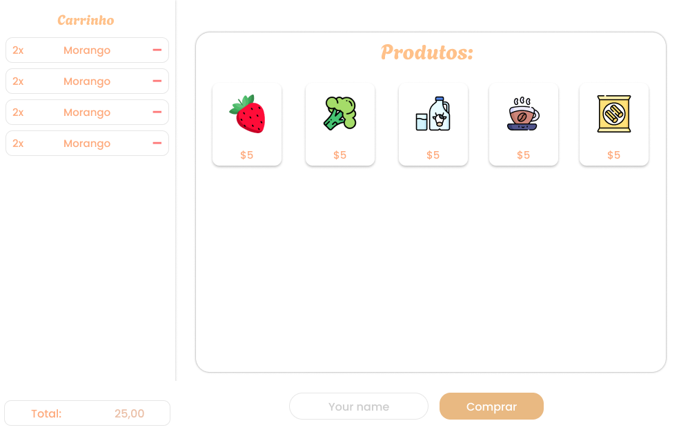

# Simple-Market

Este projeto foi desenvolvido com base em um desafio proposto pela Incantare Studios, com o objetivo de aprimorar habilidades de programação Front-End.
Ele consiste em um mercado de compras simples, onde o usuário pode visualizar os produtos disponíveis, selecioná-los e finalizar a compra. Ao concluir o processo, é exibido um recibo detalhado com os itens adquiridos.

<br>

## 🔗 Demonstração
> 🚀 **Acesse o site:**  
> https://lohan-martins.github.io/URL/

<br>

## 🧪 Tecnologias

O projeto utiliza as seguintes tecnologias:

- **HTML:** Estrutura da página.

- **CSS:** Estilização da página.

- **JavaScript:** Interatividade da página.

<br>

## 🛠️ Ferramentas
O projeto foi desenvolvido utilizando as seguintes ferramentas:

- **Figma:** Criação do mockup e protótipo da página.
- **VS Code:** Ambiente de desenvolvimento do código.
- **Git:** Controle de versionamento.
- **GitHub:** Hospedagem e gerenciamento do repositório.

<br>

## 🎨 Design
Abaixo está o mockup da página desenvolvido no Figma.



<br>

## 📦 Instalação e execução
No diretório onde o projeto deve ficar, clone o repositório do projeto.
```
# Clone o repositório
git clone <url-do-repositorio>
```
Depois, abra o arquivo `index.html` no navegador para visualizar o projeto.

<br>

## 📁 Estrutura do projeto
```
simple-market/
  ├── css/
  │    └── style.css
  ├── images/
  │    └── market-products/
  │    └── readme/
  ├── js/
  │    └── script.js
  ├── index.html
  └── README.md

```
> A estrutura acima mostra apenas os diretórios principais. Alguns arquivos foram omitidos para manter o README conciso.

<br>

## 📄 Créditos

### Fontes
#### Google fonts:
- **Poppins:** https://fonts.google.com/specimen/Poppins

### Imagens:

#### Flaticon
- **Açúcar:** <a href="https://www.flaticon.com/br/icones-gratis/acucar" title="açúcar ícones">Açúcar ícones criados por juicy_fish - Flaticon</a>
- **Água:** <a href="https://www.flaticon.com/br/icones-gratis/garrafa" title="garrafa ícones">Garrafa ícones criados por Freepik - Flaticon</a>
- **Arroz:** <a href="https://www.flaticon.com/br/icones-gratis/arroz" title="arroz ícones">Arroz ícones criados por Freepik - Flaticon</a>
- **Banana:** <a href="https://www.flaticon.com/br/icones-gratis/banana" title="banana ícones">Banana ícones criados por Smashicons - Flaticon</a>
- **Carne:** <a href="https://www.flaticon.com/br/icones-gratis/carne" title="carne ícones">Carne ícones criados por Nikita Golubev - Flaticon</a>
- **Cerveja:** <a href="https://www.flaticon.com/br/icones-gratis/cerveja" title="cerveja ícones">Cerveja ícones criados por Mzipi - Flaticon</a>
- **Couve-flor:** <a href="https://www.flaticon.com/br/icones-gratis/fruta" title="fruta ícones">Fruta ícones criados por Freepik - Flaticon</a>
- **Feijão:** <a href="https://www.flaticon.com/br/icones-gratis/agricultura-e-jardinagem" title="agricultura e jardinagem ícones">Agricultura e jardinagem ícones criados por manshagraphics - Flaticon</a>
- **Laranja:** <a href="https://www.flaticon.com/br/icones-gratis/fruta" title="fruta ícones">Fruta ícones criados por Smashicons - Flaticon</a>
- **Limão:** <a href="https://www.flaticon.com/br/icones-gratis/limao" title="limão ícones">Limão ícones criados por Smashicons - Flaticon</a>
- **Maçã:** <a href="https://www.flaticon.com/br/icones-gratis/fruta" title="fruta ícones">Fruta ícones criados por Freepik - Flaticon</a>
- **Manga:** <a href="https://www.flaticon.com/br/icones-gratis/manga" title="manga ícones">Manga ícones criados por Smashicons - Flaticon</a>
- **Massa:** <a href="https://www.flaticon.com/free-icons/pasta" title="pasta icons">Pasta icons created by Freepik - Flaticon</a>
- **Refrigerante:** <a href="https://www.flaticon.com/br/icones-gratis/refrigerante" title="refrigerante ícones">Refrigerante ícones criados por Freepik - Flaticon</a>
- **Morango:** <a href="https://www.flaticon.com/br/icones-gratis/fruta" title="fruta ícones">Fruta ícones criados por Freepik - Flaticon</a>
- **Pera:** <a href="https://www.flaticon.com/br/icones-gratis/pera" title="pera ícones">Pera ícones criados por Freepik - Flaticon</a>
- **Uvas:** <a href="https://www.flaticon.com/br/icones-gratis/uva" title="uva ícones">Uva ícones criados por Freepik - Flaticon</a>
- **Vinho:** <a href="https://www.flaticon.com/br/icones-gratis/garrafa-de-vinho" title="garrafa de vinho ícones">Garrafa de vinho ícones criados por Freepik - Flaticon</a>

#### Freepik
- **Leite:** <a href="https://br.freepik.com/icone/leite_3414361#fromView=search&page=1&position=21&uuid=cb1d8b3a-794d-4b9d-b7c7-6e644904b7ca">Ícone de amonrat rungreangfangsai</a>
- **Xicara de café:** <a href="https://br.freepik.com/icone/xicara-cafe_6248459#fromView=search&page=1&position=6&uuid=40e2baa0-b1a7-4a59-b684-99bda1ceeeea">Ícone de Freepik</a>